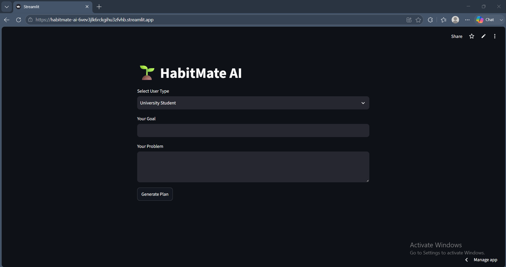

# 🌱 HabitMate AI

## 📌 Project Description

HabitMate AI is a multi-agent AI assistant developed to help users improve their daily habits, productivity, and overall lifestyle.

The system analyzes user problems, retrieves relevant information from a local knowledge base using Retrieval-Augmented Generation (RAG), and generates personalized recommendations using Large Language Models (LLMs).

The application uses an Agentic AI architecture where multiple specialized agents communicate with each other to analyze user needs, retrieve knowledge, generate recommendations, and improve responses.

---

# ✨ Features

- Multi-Agent AI Architecture
- User Profile Analysis
- Intelligent Agent Routing
- Retrieval-Augmented Generation (RAG)
- ChromaDB Vector Database
- Knowledge Base Document Retrieval
- Personalized Habit Improvement Plans
- Personalized Productivity Recommendations
- Reflection Agent for Response Improvement
- Streamlit User Interface
- LLM-based Response Generation

---

# 🏗️ System Architecture

HabitMate AI follows a multi-agent architecture.

System workflow:

```
User Input
      |
      ↓
Analyzer Agent
      |
      ↓
Router Agent
      |
      ↓
-----------------------------
|                           |
↓                           ↓
Habit Agent          Productivity Agent
|                           |
-----------------------------
            |
            ↓
Reflection Agent
            |
            ↓
     Final Response
            |
            ↓
   Streamlit Interface
```


---

# 🤖 Agent Communication Diagram

The agents communicate with each other to process user requests.

```
User
 |
 ↓
Analyzer Agent
 |
 ↓
Router Agent
 |
 ↓
Habit Agent / Productivity Agent
 |
 ↓
Reflection Agent
 |
 ↓
Final AI Response
```

## Agent Responsibilities

### Analyzer Agent
- Analyzes user input
- Identifies user goals and problems
- Creates user profile information

### Router Agent
- Selects the suitable agent
- Controls agent workflow

### Habit Agent
- Generates habit improvement suggestions
- Provides lifestyle recommendations

### Productivity Agent
- Creates productivity plans
- Provides time management suggestions

### Reflection Agent
- Reviews generated responses
- Improves final output quality


---

# 🧠 Model Choice Comparison

| Model | Provider | Purpose | Advantages | Limitations |
|---|---|---|---|---|
| Llama 3.1 8B Instant | Groq | Generate AI recommendations | Fast and efficient | Requires API access |
| MiniLM-L6-v2 | HuggingFace | Text embeddings | Lightweight and fast | Limited reasoning |
| ChromaDB | Local | Vector database | Efficient similarity search | Requires local setup |

---

# 📚 RAG Pipeline Explanation

HabitMate AI uses Retrieval-Augmented Generation (RAG) to provide accurate recommendations by retrieving relevant information from a knowledge base.

## RAG Workflow

```
User Query
     |
     ↓
Analyzer Agent
     |
     ↓
Retriever Agent
     |
     ↓
ChromaDB Vector Database
     |
     ↓
Relevant Documents
     |
     ↓
Selected AI Agent
     |
     ↓
Response Generation
     |
     ↓
Reflection Agent
     |
     ↓
Final Answer
```

## RAG Process

1. User enters their goal and problem through the Streamlit interface.

2. Analyzer Agent analyzes the user information.

3. Router Agent selects the appropriate specialized agent.

4. Retriever Agent searches the knowledge base.

5. ChromaDB retrieves relevant documents using semantic similarity.

6. Retrieved information is provided to the selected agent.

7. The agent generates a personalized recommendation.

8. Reflection Agent improves the response.

9. The final response is displayed to the user.

---

# 📁 Project Structure

```
HabitMate-AI/

│
├── agents/
│   ├── analyzer.py
│   ├── habit_agent.py
│   ├── productivity_agent.py
│   └── reflection.py
│
├── rag/
│   ├── vectorstore.py
│   └── retriever.py
│
├── workflow/
│   └── router.py
│
├── knowledge_base/
│
├── app.py
│
├── requirements.txt
│
├── README.md
│
└── .env
```

---

# ⚙️ Setup Instructions

## Clone Repository

```bash
git clone https://github.com/KattadigeHiruniDineka/HabitMate-AI
```

## Navigate to Project

```bash
cd HabitMate-AI
```

## Install Dependencies

```bash
pip install -r requirements.txt
```


## Run Application

```bash
streamlit run app.py
```

---

## 🚀 Live Streamlit Demo

Click here to try HabitMate AI:

https://habitmate-ai-6vev3jlk6rckgihu3zfvhb.streamlit.app
---
## 🎥 Demo Video

A short demonstration of HabitMate AI:

[Watch Demo Video](https://youtu.be/ULDVWtE3Gwo?si=-degJTbrDW6e2iIz)

---
## 🖥️ Application Interface



---
# 💻 Technologies Used

- Python
- Streamlit
- LangChain
- LangGraph
- ChromaDB
- HuggingFace Embeddings
- Groq API
- PyPDF
- GitHub

---

# ⚠️ Known Limitations

- Requires internet connection for LLM API access.
- Response quality depends on the knowledge base.
- Supports predefined lifestyle improvement scenarios.
- Currently supports English responses only.
- Does not maintain long-term user history.

---

# 🔮 Future Improvements

- Add Nutrition Agent
- Add Fitness Agent
- Add User Authentication
- Add Progress Tracking Dashboard
- Add Mobile Application
- Add Database Integration
- Add Multi-language Support

---
## Model Selection

HabitMate AI uses the Groq LLM for response generation.

### Why Groq?

- Fast inference speed
- Free developer API
- LangChain compatible
- Suitable for real-time Streamlit applications

---

# 👩‍💻 Developer Information

**Developer Name:** K. Hiruni Dineka  

**Module:** IT41043 – Intelligent Systems (Agentic AI)  

**Project Title:** HabitMate AI  

**Description:**  
Multi-Agent AI Assistant for Habit and Productivity Improvement.

HabitMate AI helps university students improve habits, productivity, learning skills, and time management using Agentic AI, RAG architecture, and knowledge-based recommendations.